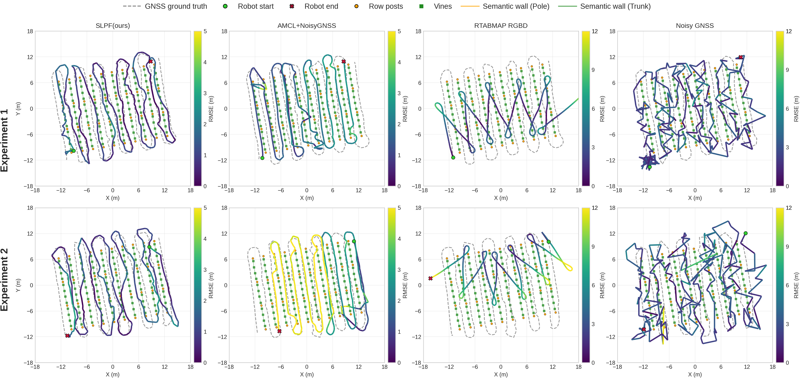

# Outdoor_SLPF

Semantic landmark particle filtering for outdoor row-structured environments.

This repository accompanies the paper `Semantic-Aware Particle Filter for Reliable Vineyard Robot Localisation` and packages the core SPF/SPF++ implementation, the evaluation pipeline, and the paper-facing documentation needed to understand and reproduce the published workflows.

Preprint: https://arxiv.org/pdf/2509.18342

## Repository scope

This public release is centered on:

- the main localisation pipeline in `scripts/spf_lidar.py`
- the evaluation and aggregation workflow used in the paper
- curated map, trajectory, and model assets required by those workflows

Baseline methods such as AMCL, RTAB-Map, and ORB-SLAM3 are treated here as precomputed trajectory inputs. The recommended public release does not depend on shipping their native runtime stacks.

## Repository layout

- `data/` contains processed traverses, trajectory inputs, and semantic map artifacts
- `models/` contains trained weights used by the SPF pipeline
- `configs/` contains sensor and camera configuration files
- `scripts/` contains localisation, evaluation, aggregation, and plotting code
- `docs/` contains setup notes, methodology, and experiment protocols
- `results/` contains generated outputs and paper figures

## Quick start

For evaluation-only workflows:

```bash
python -m venv .venv
source .venv/bin/activate
pip install -r requirements.txt
python3 scripts/compute_metrics.py
bash scripts/run_evo_all.sh
python3 scripts/aggregate_evo_results.py
```

For the full SPF pipeline, including semantic inference and runtime profiling, see `docs/SETUP.md`.

## Main workflows

Run the semantic particle filter on a processed traverse:

```bash
python3 scripts/spf_lidar.py \
  --data-path data/2025/rh_run1 \
  --output-folder results/example_run \
  --no-visualization
```

Generate paper figures and tables:

```bash
python3 scripts/plot_trajectories_2x4_experiment_comparison.py
python3 scripts/plot_vineyard_structure_with_rtk.py
```

Run release-facing experiment extensions:

- `scripts/run_spfpp_ablation.py` for SPF++ ablations
- `scripts/run_runtime_profile_experiment.py` for throughput and stage timing
- `scripts/run_run1_robustness_experiments.py` for robustness studies

## Representative results

Qualitative comparison across the two main experiments:



Plot provenance and inputs are documented in `results/plots/PLOT_SOURCES.md`.

The compact tables below report multiseed means over seeds `11,22,33`. Lower is better for all metrics except `Row correct`.

Experiment 1 source: `results/iros_rh1/final_20260217/trajectory_metrics_multiseed_aggregate.csv`

| Method | APE align RMSE (m) | RPE 5m align RMSE (m) | Cross-track mean (m) | Row correct |
| --- | ---: | ---: | ---: | ---: |
| SLPF (ours) | 1.093 | 7.066 | 1.232 | 0.726 |
| AMCL | 1.300 | 5.517 | 1.290 | 0.623 |
| AMCL+NoisyGNSS | 1.461 | 5.405 | 1.354 | 0.616 |
| Noisy GNSS | 2.978 | 3.988 | 1.771 | 0.644 |
| RTAB-Map RGBD | 6.810 | 8.255 | 5.834 | 0.368 |

Experiment 2 source: `results/iros_rh2/20260225_105822_multiseed_all_methods/trajectory_metrics_multiseed_aggregate.csv`

| Method | APE align RMSE (m) | RPE 5m align RMSE (m) | Cross-track mean (m) | Row correct |
| --- | ---: | ---: | ---: | ---: |
| SLPF (ours) | 1.114 | 6.816 | 1.455 | 0.668 |
| AMCL | 2.043 | 3.429 | 1.551 | 0.549 |
| AMCL+NoisyGNSS | 1.976 | 3.422 | 1.512 | 0.554 |
| Noisy GNSS | 3.088 | 4.222 | 1.990 | 0.577 |
| RTAB-Map RGBD | 9.063 | 3.430 | 7.247 | 0.415 |

The ablation study and the full paper artifact bundle are prepared separately from this source-focused release commit.

## Documentation

- `docs/SETUP.md` explains dependencies, expected data layout, and install variants
- `docs/PIPELINE.md` explains the working principle of the semantic particle filter
- `docs/EXPERIMENT_RUNNER_AND_METRICS.md` defines the evaluation pipeline and all reported metrics
- `docs/RUNTIME_EXPERIMENT.md` documents the runtime profiling protocol
- `docs/RUN1_ADDITIONAL_EXPERIMENTS.md` documents the additional robustness study
- `docs/PUBLIC_RELEASE_SCOPE.md` records what should and should not be bundled in the public release commit

## Included assets and exclusions

- Processed experiment assets and semantic maps are tracked for reproducibility
- Raw sensor logs and large intermediate archives are intentionally excluded
- Native AMCL and ORB-SLAM3 runtime helpers are outside the recommended public release scope

## Citation

If you use this repository, please cite the accompanying paper. A machine-readable citation file is provided in `CITATION.cff`.

```bibtex
@article{de2025semantic,
  title={Semantic-Aware Particle Filter for Reliable Vineyard Robot Localisation},
  author={de Silva, Rajitha and Cox, Jonathan and Heselden, James R and Popovic, Marija and Cadena, Cesar and Polvara, Riccardo},
  journal={arXiv preprint arXiv:2509.18342},
  year={2025}
}
```

## License

This repository is distributed under the PolyForm Noncommercial License 1.0.0. See `LICENSE.md`.
